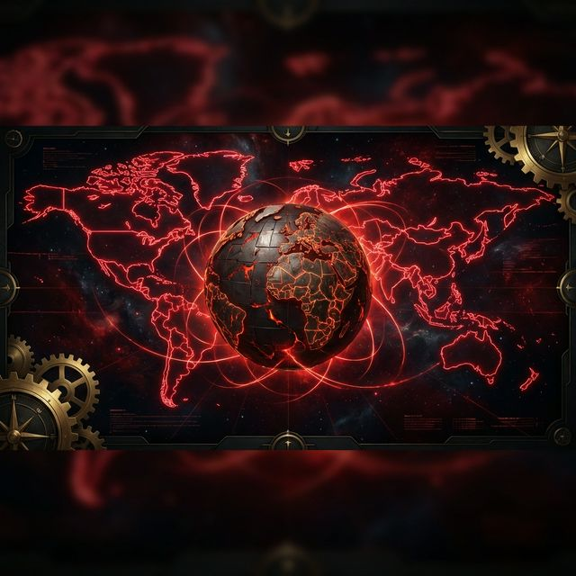
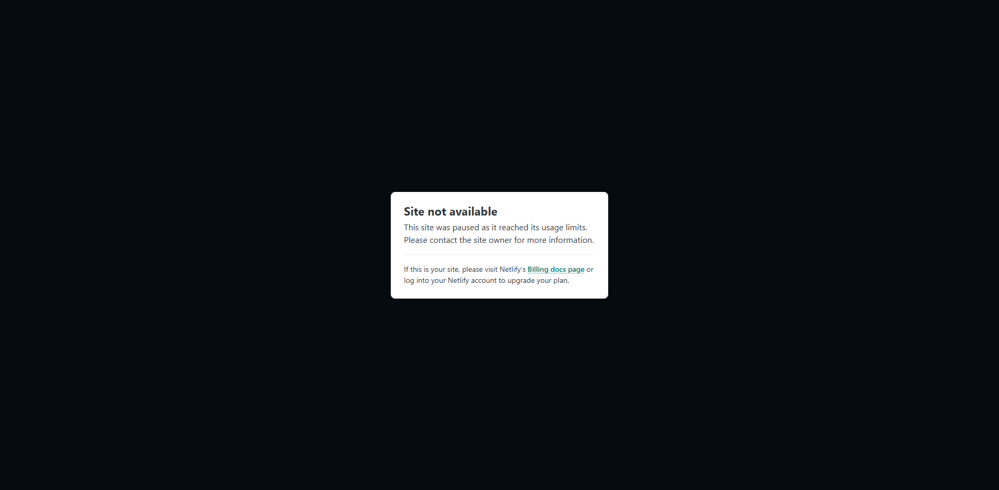

# 🌍 RULE THE WORLD: 2029 Geopolitical Simulator

### 🚀 **[Live Demo: Play the Geopolitical Strategy Simulator](https://ruletheworldmadebyaaj.netlify.app/)**



## 🎯 Strategic Value: The "Why"
In a world of generic strategy games, **RULE THE WORLD** stands out as a hyper-realistic lens into the near future. Set in 2029, it challenges players to navigate the complex, high-stakes reality of modern geopolitics—where a single trade agreement or military skirmish can shift the global balance of power.

## 👥 Who This Is For
- **Agencies & Creative Firms**: Building interactive, data-driven brand experiences or gamified marketing campaigns.
- **Educational Tech (EdTech)**: Prototyping strategic thinking tools and regional risk training modules.
- **Consulting Firms**: Demonstrating complex state management and interactive situational simulations.

## ✨ Key Features
- **Deep Geopolitical Systems**: Manage resource extraction, military doctrine, and bilateral diplomacy.
- **2029 Scenario Engine**: Experience procedurally influenced events based on current global trends.
- **Immersive Strategic UI**: Designed for high-density information management without sacrificing aesthetic polish.

## 🛠️ Tech Stack
- **Engine**: Vanilla JavaScript (Custom State Management & Logic)
- **Frontend**: HTML5, CSS3 (Modern Flex/Grid Architecture)
- **Deployment**: Netlify

## 🚀 Local Setup
```bash
git clone https://github.com/amanamarjit243222/RULE-THE-WORLD.git
cd RULE-THE-WORLD
# Start a local server (e.g., Python)
python -m http.server 8000
```

## 📸 In-Game Preview

